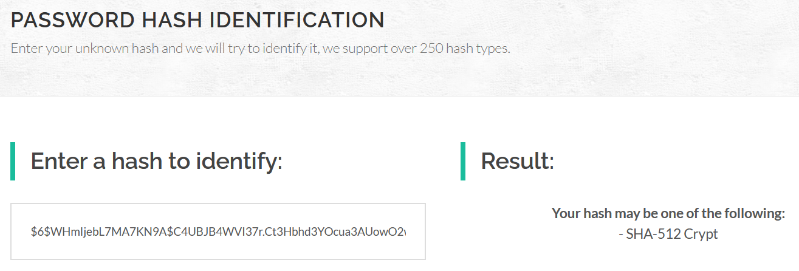

## Privilege Escalation with Leaked Hashed Password
[< Back to Menu](README.md)
## [Hashes.com](https://hashes.com/en/tools/hash_identifier)
- Able to identify the hash type
- Able to crack has if found on the database

## [Crackstation.net](https://crackstation.net/)
- Able to identify the hash type
- Able to crack has if found on the database
- Very big wordlists and free to [download](https://crackstation.net/crackstation-wordlist-password-cracking-dictionary.htm)

## [OnlineHashCrack.com](https://www.onlinehashcrack.com/hash-identification.php)
- Able to identify the hash type faster and more reliable
- Wider range of hash types
- [Hash crack service](https://www.onlinehashcrack.com/) - Cracking service with highest performance but `not free`

